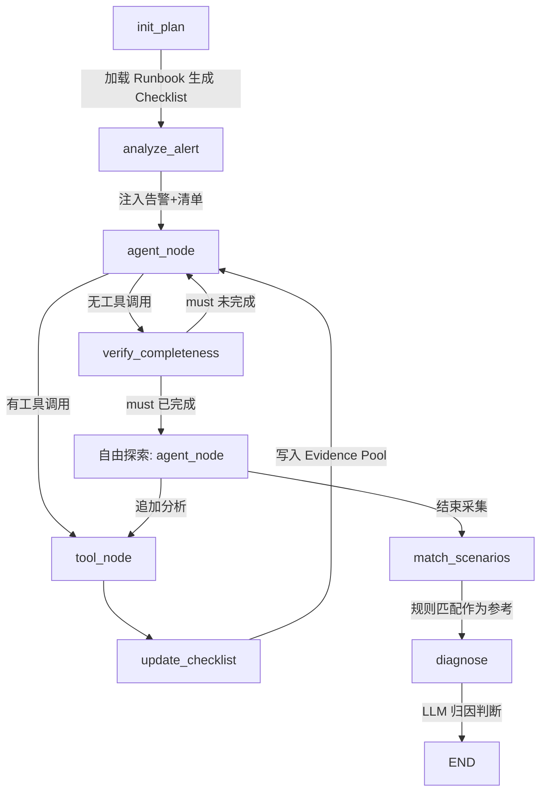

# AIOps Diagnostic Agent

基于 LangGraph 构建的 AIOps 智能归因分析 Agent，采用 **Checklist-Driven** 架构，将业务专家的归因经验通过声明式 YAML Runbook 编码，实现结构化、可审计的指标异常归因。

## 核心特性

- **Checklist-Driven 执行**：归因步骤由 YAML 采集计划定义，程序化追踪完成状态，保证不遗漏关键分析
- **Query / Compute 两类工具**：查询工具只取数，计算工具只计算（贡献度、公式拆解、相关性、事件命中）——职责单一，便于复用与扩展
- **规则匹配作参考 + LLM 主导归因**：已知场景通过结构化规则快速匹配，LLM 结合证据池做最终归因，也能发现规则未覆盖的新故障模式
- **Evidence Pool 共享结果池**：同一分析步骤只执行一次，多场景共享结果，避免重复查数
- **自由探索**：清单必要步骤完成后 LLM 可根据中间结果追加分析，实现真正的 ReAct 推理
- **并发执行**：通过 `depends_on` 声明步骤间依赖，无依赖步骤支持并发调用
- **结构化报告**：`src/report/markdown.py` 把告警 + 清单状态 + 证据池 + 场景匹配 + LLM 归因一并渲染为可审计的 Markdown
- **多 LLM 支持**：Claude / OpenAI / 智谱 AI

## 技术栈

- **Agent 框架**：LangGraph（状态图 + 条件路由）
- **LLM**：LangChain（Claude / OpenAI / 智谱 AI 适配）
- **知识编码**：YAML 声明式 Runbook（analysis_plan + rules_*）
- **分析算法**：结构贡献度分解、LMDI 指数分解、GINI 系数、皮尔逊相关
- **CLI**：Rich
- **测试**：pytest（单元 + 集成）

## 架构



### 三阶段执行流程

| 阶段 | 节点 | 驱动方 | 说明 |
|---|---|---|---|
| 数据采集 | init_plan → agent_node ⇄ tool_node | Checklist | 按清单执行 must/should 步骤 |
| 自由探索 | agent_node ⇄ tool_node | LLM | 根据中间结果追加分析（真正的 ReAct） |
| 归因判断 | match_scenarios → diagnose | 规则 + LLM | 规则匹配作参考，LLM 综合证据池推理 |

### 工具集（7 个，Query / Compute 两类）

| 类别 | 工具 | 用途 |
|---|---|---|
| Query | `query_metric` | 指标查询（整体 / 维度下钻 / 过滤三合一） |
| Query | `query_logs` | 日志查询（支持 keyword / level / source） |
| Query | `query_events` | 变更事件查询（deployment / config / scaling） |
| Compute | `decompose_metric` | 维度分解：结构贡献度 + GINI 集中度（比率型指标） |
| Compute | `decompose_formula` | 公式拆解 LMDI（乘法型指标，需声明 sub_metrics） |
| Compute | `analyze_correlation` | 基础指标 vs 关联指标的皮尔逊相关 |
| Compute | `match_events` | 按关键词/类型命中变更事件，返回 matched 布尔位 |

所有工具返回"人类可读文本 + `===EVIDENCE===` JSON 证据块"双格式：前半段给 LLM 看，后半段给规则引擎精确解析。

### 文件结构

```
├── cli.py                          # CLI 入口
├── runbooks/                       # 归因知识库（业务专家维护）
│   ├── play_success_rate/          # 场景族 1：播放成功率
│   │   ├── _meta.yaml
│   │   ├── analysis_plan.yaml      # 采集计划（去重后的分析步骤）
│   │   ├── rules_cdn_fault.yaml
│   │   ├── rules_isp_fault.yaml
│   │   ├── rules_client_bug.yaml
│   │   └── rules_network_issue.yaml
│   └── p2p_bandwidth_share/        # 场景族 2：P2P 大盘带宽占比
│       ├── _meta.yaml
│       ├── analysis_plan.yaml      # 含 phone_effective_coverage 公式漏斗
│       ├── rules_box_sharing.yaml
│       ├── rules_rtm_expansion.yaml
│       └── rules_phone_sharing.yaml
├── src/
│   ├── agent/                      # Agent 核心（state / graph / nodes / prompts）
│   ├── knowledge/                  # runbook_loader + rule_matcher
│   ├── llm/                        # Claude / OpenAI / 智谱 适配
│   ├── tools/                      # 7 个工具（Query / Compute）
│   ├── data/                       # 模拟数据层（models / scenarios / simulator）
│   └── report/                     # 结构化 Markdown 报告生成
└── tests/
    ├── test_tools.py               # 算法单元测试
    ├── test_knowledge.py           # 知识模块单元测试
    └── test_scenarios.py           # 端到端场景（集成 + 规则匹配）
```

## 快速开始

### 安装

```bash
# 推荐 uv
uv sync
# 或 pip
pip install -e ".[dev]"
```

### 配置

```bash
cp .env.example .env
# 填入 API Key（ANTHROPIC_API_KEY / OPENAI_API_KEY / ZHIPU_API_KEY 任一即可）
```

### 运行

```bash
# 交互式选择场景
python cli.py

# 指定场景 + LLM
python cli.py --scenario play_success_rate_drop --llm claude
python cli.py --scenario buffering_rate_rise
python cli.py --scenario first_frame_latency_degradation
python cli.py --scenario phone_sharing_coverage_drop --llm zhipu
```

输出会在 `output/report_<scenario>_<timestamp>.md` 保存一份结构化报告（告警 / 清单状态 / 证据池 / 规则匹配 / LLM 归因五段式）。

### 测试

```bash
# 单元测试 + 不依赖 LLM 的 E2E（规则匹配、报告渲染）
pytest -m 'not integration' -v

# 依赖 LLM 的集成测试
pytest -m integration -v
```

## 预置场景

| 场景 | 告警指标 | 预期根因 |
|---|---|---|
| `play_success_rate_drop` | 播放成功率 99.2% → 97.8% | CDN 华南节点配置变更（连接池缩减） |
| `buffering_rate_rise` | 卡顿率 3.2% → 5.1% | 转码 CRF 参数调大导致视频质量下降 |
| `first_frame_latency_degradation` | 首帧 P95 800ms → 1200ms | 中国电信 DNS 节点维护导致解析延迟 |
| `phone_sharing_coverage_drop` | P2P 大盘占比 45% → 40% | 手机 Android/app_1 连接成功率骤降，手机有效覆盖度下跌 |

## 核心算法

### 结构贡献度分解（比率型指标）

把指标变化拆成**性能效应**（各维度值本身的变化）和**结构效应**（流量占比迁移）：

```
ΔV_a = 0.5×(P_a1+P_a0)×(V_a1-V_a0) + [0.5×(V_a1+V_a0) - V_0]×(P_a1-P_a0)
        ├── 性能效应 ──────────────┘   └── 结构效应 ────────────────────────┘
```

### LMDI 指数分解（乘法型指标）

适用于 `E = Σ(S_i × I_i)` 的乘法/加性组合。`analysis_plan.yaml` 里需要声明 `formula.sub_metrics`，如：

```
phone_effective_coverage = 返回节点成功率 × 连接成功率 × 尝试订阅率 × 订阅成功率
```

工具会把每个子指标的 t1/t2 跑 LMDI 拆出漏斗中哪一步是瓶颈。

### GINI 系数

衡量问题在各维度上的集中程度：> 0.7 高度集中（少数维度导致），< 0.4 分散（全局性问题）。

## 如何添加新指标的归因知识

### 1. 创建目录 + 元信息

```bash
mkdir -p runbooks/your_metric
```

```yaml
# runbooks/your_metric/_meta.yaml
metric: your_metric
display_name: "你的指标名"
related_metrics: [metric_a, metric_b]
```

### 2. 定义采集计划

```yaml
# runbooks/your_metric/analysis_plan.yaml
metric: your_metric
steps:
  - id: overall_trend
    name: "查询整体趋势"
    priority: must              # must / should
    action: query_metric        # 对应工具名
    params: { metric: your_metric }
    depends_on: []

  - id: decompose_by_isp
    name: "按运营商分解"
    priority: must
    action: decompose_metric
    params: { metric: your_metric, dimension: isp }
    depends_on: [overall_trend]
```

### 3. 定义场景规则

```yaml
# runbooks/your_metric/rules_xxx.yaml
scenario: your_scenario
display_name: "场景名"
required_evidence: [overall_trend, decompose_by_isp]
rules:
  - id: rule_1
    name: "规则名"
    conditions:
      - step: overall_trend
        field: rate_of_change
        op: "<"
        value: -0.03
      - step: decompose_by_isp
        field: gini
        op: ">"
        value: 0.7
    confidence: high
    conclusion: "结论描述"
    suggested_action: "建议操作"
```

可用字段取决于工具证据块里的 JSON 字段名（如 `rate_of_change` / `gini` / `top1_contribution` / `has_release` / `found`），直接参见各工具源码末尾的 `payload` 构造。

## 设计理念

### 从 ProcessConfig 到 Checklist-Driven Agent

| 传统配置化系统 | Agent 系统 |
|---|---|
| ProcessConfig JSON 管理归因路径 | analysis_plan.yaml + rules_*.yaml |
| 程序遍历树节点调用函数 | Agent 按 Checklist 调用工具 |
| 多场景树展平去重 | 采集计划天然去重 |
| 结果回填各场景 | Evidence Pool 共享结果池 |
| 规则匹配出最终结论 | 规则匹配作参考，LLM 做最终判断 |
| 只走预定义路径 | 预定义路径 + LLM 自由探索 |

核心优势：**保留了配置化系统的确定性和完整性，同时获得了 LLM 发现新故障模式的能力**。

## License

MIT
