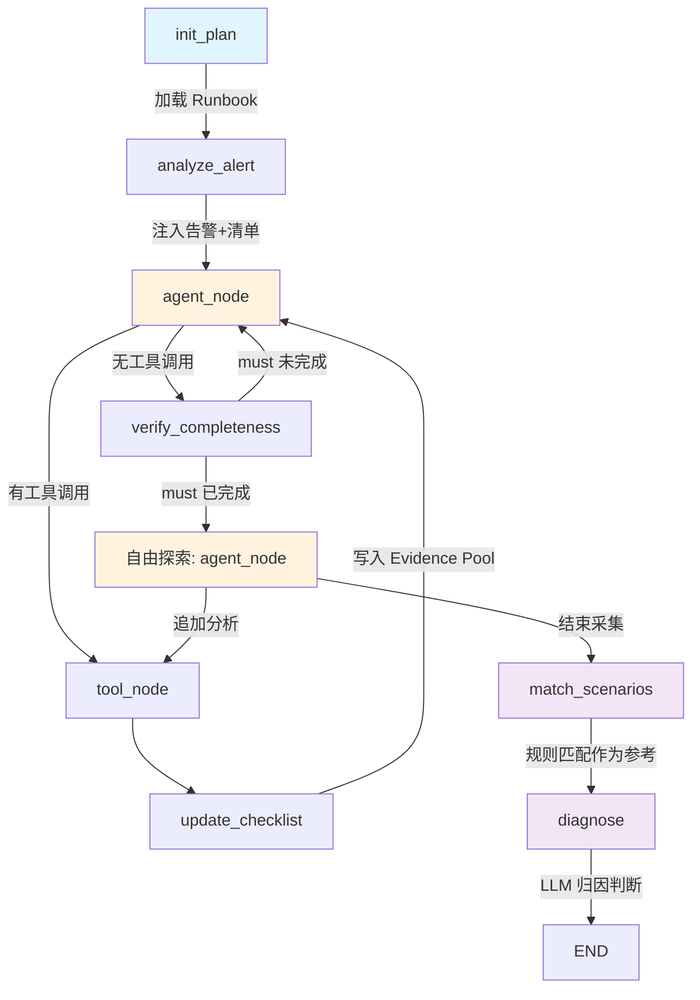

# AIOps Diagnostic Agent

基于 LangGraph 构建的 AIOps 智能归因分析 Agent，采用 **Checklist-Driven** 架构，将业务专家的归因经验通过声明式 YAML Runbook 编码，实现结构化、可审计的指标异常归因。

## 核心特性

- **Checklist-Driven 执行**：归因分析步骤由 YAML 采集计划定义，程序化追踪完成状态，保证不遗漏关键分析
- **规则兜底 + LLM 主导归因**：已知场景通过规则快速匹配作为参考，LLM 做最终判断，也能发现规则未覆盖的新故障模式
- **Evidence Pool 共享结果池**：同一分析步骤只执行一次，多场景共享结果，避免重复查数
- **自由探索**：完成必要步骤后 LLM 可根据中间结果追加分析，实现真正的 ReAct 推理
- **并发执行**：通过 `depends_on` 声明步骤间依赖，无依赖步骤支持并发调用
- **三层完整性保障**：Prompt 引导 → 程序化追踪 → 兜底校验，must 步骤 100% 执行
- **多 LLM 支持**：Claude / OpenAI / 智谱 AI

## 技术栈

- **Agent 框架**: LangGraph (状态图 + 条件路由)
- **LLM**: LangChain (Claude / OpenAI / 智谱 AI 适配)
- **知识编码**: YAML 声明式 Runbook
- **分析算法**: 结构贡献度分解、LMDI 指数分解、GINI 系数
- **CLI**: Rich (终端美化)
- **测试**: pytest (单元 + 集成)

## 架构



### 三阶段执行流程

| 阶段 | 节点 | 驱动方 | 说明 |
|---|---|---|---|
| 数据采集 | init_plan → agent_node ⇄ tool_node | Checklist | 按清单执行 must/should 步骤 |
| 自由探索 | agent_node ⇄ tool_node | LLM | 根据中间结果追加分析（真正的 ReAct） |
| 归因判断 | match_scenarios → diagnose | 规则+LLM | 规则匹配参考 + LLM 综合推理 |

### 文件结构

```
├── cli.py                          # CLI 入口
├── runbooks/                       # 归因知识库（业务专家维护）
│   └── play_success_rate/
│       ├── _meta.yaml              # 指标元信息
│       ├── analysis_plan.yaml      # 采集计划（去重后的分析步骤）
│       ├── rules_cdn_fault.yaml    # CDN 故障场景规则
│       ├── rules_isp_fault.yaml    # 运营商故障场景规则
│       ├── rules_client_bug.yaml   # 客户端 Bug 场景规则
│       └── rules_network_issue.yaml# 网络问题场景规则
├── src/
│   ├── agent/                      # Agent 核心
│   │   ├── state.py                # 状态定义 (phase/checklist/evidence_pool)
│   │   ├── graph.py                # LangGraph 流程图
│   │   ├── nodes.py                # 节点实现 (两阶段 + 自由探索)
│   │   └── prompts.py              # Prompt 模板 (ReAct/探索/归因)
│   ├── knowledge/                  # 知识管理
│   │   ├── runbook_loader.py       # YAML Runbook 加载 + Checklist 生成
│   │   └── rule_matcher.py         # 场景规则匹配引擎
│   ├── llm/                        # LLM 适配层
│   │   ├── base.py / claude.py / openai.py / zhipu.py
│   ├── tools/                      # 分析工具集
│   │   ├── query_metrics.py        # 指标时序查询
│   │   ├── drill_down.py           # 维度下钻
│   │   ├── contribution.py         # 结构贡献度 + LMDI 分解
│   │   ├── concentration.py        # GINI 系数集中度分析
│   │   ├── compare_points.py       # 两点对比
│   │   ├── search_logs.py          # 日志搜索
│   │   └── check_changes.py        # 变更事件查询
│   └── data/                       # 模拟数据层
│       ├── models.py               # 数据模型
│       ├── scenarios.py            # 3 个预置故障场景
│       └── simulator.py            # 数据模拟器
└── tests/
    ├── test_tools.py               # 工具算法单元测试
    ├── test_knowledge.py           # 知识模块单元测试
    └── test_scenarios.py           # 端到端集成测试
```

## 快速开始

### 安装

```bash
# 使用 uv（推荐）
uv sync

# 或 pip
pip install -e ".[dev]"
```

### 配置

```bash
cp .env.example .env
# 编辑 .env 填入 API Key（支持 ANTHROPIC_API_KEY / OPENAI_API_KEY / ZHIPU_API_KEY）
```

### 运行

```bash
# 交互式选择场景
python cli.py

# 指定场景 + LLM
python cli.py --scenario play_success_rate_drop --llm claude
python cli.py --scenario buffering_rate_rise --llm zhipu
python cli.py --scenario first_frame_latency_degradation --llm openai
```

### 测试

```bash
# 单元测试（不需要 LLM API）
pytest tests/test_tools.py tests/test_knowledge.py tests/test_scenarios.py::TestScenarioData -v

# 集成测试（需要 LLM API）
pytest -m integration -v
```

## 预置场景

| 场景 | 告警指标 | 预期根因 |
|---|---|---|
| `play_success_rate_drop` | 播放成功率 99.2% → 97.8% | CDN 华南节点配置变更（连接池缩减） |
| `buffering_rate_rise` | 卡顿率 3.2% → 5.1% | 转码 CRF 参数调大导致视频质量下降 |
| `first_frame_latency_degradation` | 首帧 P95 800ms → 1200ms | 中国电信 DNS 节点维护导致解析延迟 |

## 核心算法

### 结构贡献度分解

将指标变化分解为**性能效应**（各维度值本身的变化）和**结构效应**（流量占比的迁移）：

```
ΔV_a = 0.5×(P_a1+P_a0)×(V_a1-V_a0) + [0.5×(V_a1+V_a0) - V_0]×(P_a1-P_a0)
        ├── 性能效应 ──────────────┘   └── 结构效应 ────────────────────────┘
```

### GINI 系数

衡量问题在各维度上的集中程度：> 0.7 高度集中（少数维度导致），< 0.4 分散（全局性问题）。

## 如何添加新指标的归因知识

### 1. 创建目录和元信息

```bash
mkdir -p runbooks/your_metric
```

```yaml
# runbooks/your_metric/_meta.yaml
metric: your_metric
display_name: "你的指标名"
```

### 2. 定义采集计划

```yaml
# runbooks/your_metric/analysis_plan.yaml
steps:
  - id: step_1
    name: "查询整体趋势"
    priority: must          # must / should
    action: query_metrics   # 对应工具名
    params: { metric: your_metric }
    depends_on: []
```

### 3. 定义场景规则（可选，作为 LLM 归因参考）

```yaml
# runbooks/your_metric/rules_xxx.yaml
scenario: your_scenario
display_name: "场景名"
required_evidence: [step_1, step_2]
rules:
  - id: rule_1
    name: "规则名"
    conditions:
      - step: step_1
        field: rate_of_change
        op: ">"
        value: 0.2
    confidence: high
    conclusion: "结论描述"
    suggested_action: "建议操作"
```

## 设计理念

### 从 ProcessConfig 到 Checklist-Driven Agent

本项目源自对传统配置化归因系统的 Agent 化改造：

| 传统配置化系统 | Agent 系统 |
|---|---|
| ProcessConfig JSON 管理归因路径 | analysis_plan.yaml + rules_*.yaml |
| 程序遍历树节点调用函数 | Agent 按 Checklist 调用工具 |
| 多场景树展平去重 | 采集计划天然去重 |
| 结果回填各场景 | Evidence Pool 共享结果池 |
| 规则匹配出最终结论 | 规则匹配作参考，LLM 做最终判断 |
| 只走预定义路径 | 预定义路径 + LLM 自由探索 |

核心优势：**保留了配置化系统的确定性和完整性，同时获得了 LLM 发现新故障模式的能力**。

## License

MIT
